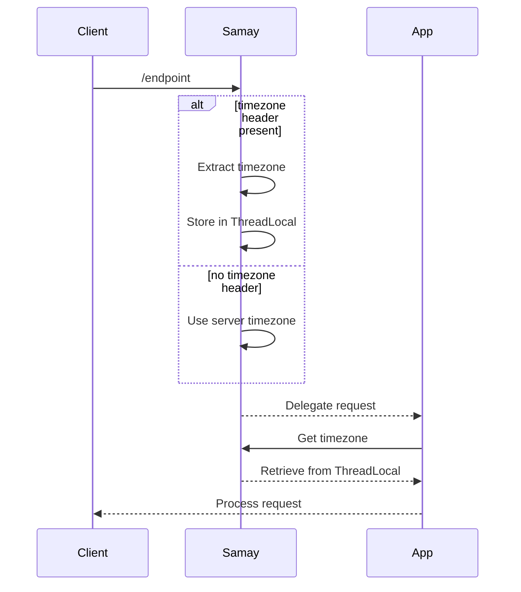

# Samay's Request processing flow

```mermaid
sequenceDiagram
    participant Client
    participant Samay
    participant App

    Client->>Samay: /endpoint
    alt timezone header present
        Samay->>Samay: Extract timezone
        Samay->>Samay: Store in ThreadLocal
    else no timezone header
        Samay->>Samay: Use server timezone
    end

    Samay-->>App: Delegate request

    App->>Samay: Get timezone
    Samay-->>App: Retrieve from ThreadLocal

    App-->>Client: Process request
```